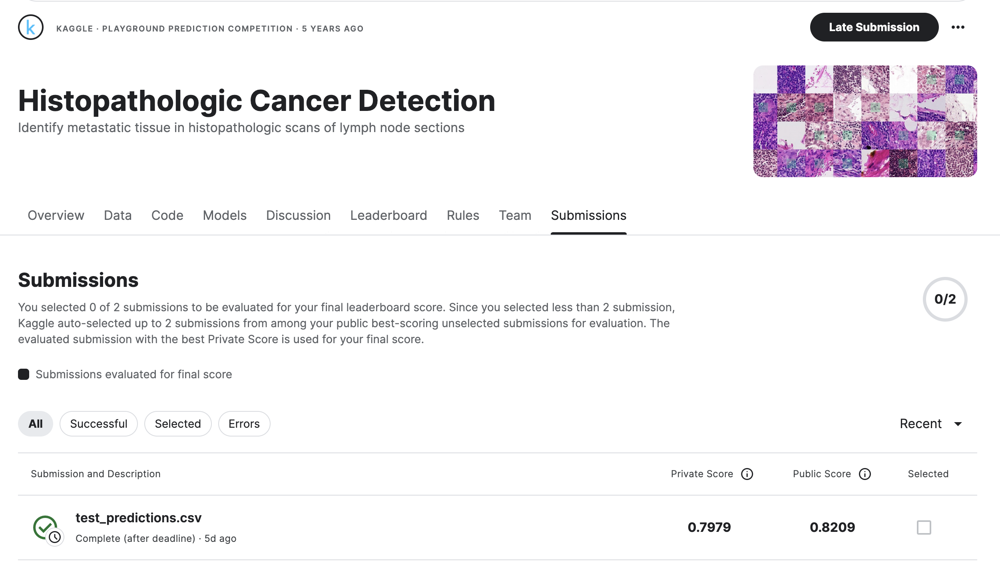

# Histopathologic Cancer Detection using Neural Networks

## Author

- Carlos Alvarado Martinez

## Introduction

The goal of this project is to classify histopathologic images to detect cancerous tissues using a deep learning approach. The primary focus is to build a convolutional neural network (CNN) model that can accurately classify the images into cancerous or non-cancerous categories.

## Dataset

The dataset used in this project is the Kaggle Histopathologic Cancer Detection dataset. It consists of images and labels indicating whether each image contains metastatic tissue.

- **Training Data**: 220,025 images
- **Test Data**: 57,458 images

Each image is a 96x96 pixel RGB image, and the labels are binary (0 for non-cancerous, 1 for cancerous).

## Methodology

The project follows these main steps:

1. **Data Exploration**:
   - Load and visualize the dataset.
   - Perform Exploratory Data Analysis (EDA) to understand the distribution and nature of the data.

2. **Data Preprocessing**:
   - Resize and normalize images.
   - Split the dataset into training and validation sets.
   - Handle class imbalance using class weights.

3. **Model Building**:
   - Define a Convolutional Neural Network (CNN) model using a pre-trained ResNet50 as the base model.
   - Compile the model with appropriate loss function and optimizer.

4. **Model Training**:
   - Train the model on the training dataset.
   - Use callbacks for early stopping, learning rate reduction, and model checkpointing.
   - Apply class weights to handle class imbalance.

5. **Model Evaluation**:
   - Evaluate the model performance on the validation set.
   - Fine-tune the model by unfreezing some layers of the base model.
   - Re-train and evaluate the fine-tuned model.

6. **Testing**:
   - Load and preprocess test images.
   - Use the trained model to make predictions on the test dataset.
   - Save the predictions to a CSV file.

## Conclusions

1. **Label Distribution**: 
   - The dataset shows a slight imbalance with more non-cancerous samples than cancerous ones.

2. **Image Samples**: 
   - Sample images confirm the variety and quality needed for effective model training.

3. **Model Training Insights**:
   - Initial training with ResNet50 achieved a good accuracy, which was further improved through fine-tuning.

4. **Class Weights Handling**:
   - Adjusting class weights helped in dealing with the class imbalance, improving model performance.

5. **Learning Rate Adjustments**:
   - A dynamic learning rate strategy was crucial for achieving better convergence.

6. **Overall Model Performance**:
   - The final model demonstrated a high accuracy on both training and validation sets, indicating strong generalization.

## Score

## Acknowledgements

- The dataset used in this project is provided by Kaggle: [Histopathologic Cancer Detection](https://www.kaggle.com/c/histopathologic-cancer-detection)

